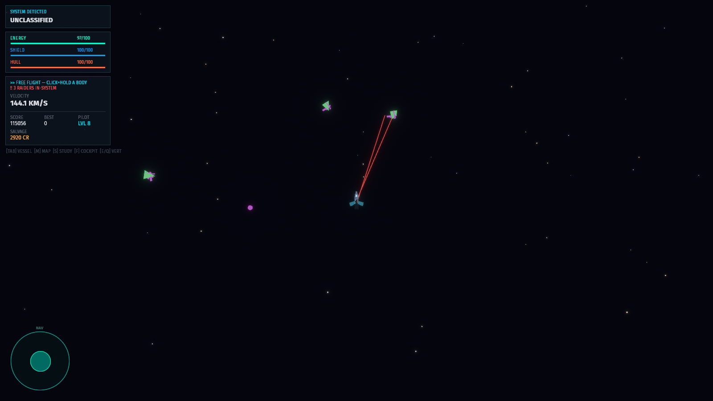

<h1 align="center">ORBIT JUMPER</h1>

<p align="center"><em>Hitch rides on gravity. Fight off the raiders. Keep your orbit if you can.</em></p>

<p align="center">
  <a href="https://edgarhsanchez.github.io/orbit_jumper/"><strong>▶&nbsp;&nbsp;PLAY IN YOUR BROWSER</strong></a>
  &nbsp;·&nbsp; desktop, iOS, Android — no install
</p>

<p align="center">
  
</p>

Real orbital mechanics in a hostile system. Propulsion is deliberately weak
against interplanetary distances — getting anywhere means **hitching rides on
gravity**: click-and-hold a planet's orbit ring and the ship burns into a
capture, then the planet carries you around the system for free. Dive past a
body in free flight and its gravity — real, integrated — slings you out
faster. Meanwhile alien raiders hunt you in packs of up to six that keep
getting tougher with your pilot level, forever.

## The game

| | |
|---|---|
|  | **Ride the rings.** Every body advertises orbit rings — larger bodies throw larger rings, so a giant can be leapt onto from far away. Click and hold a ring; the ship plans the burn, captures, and rides. Energy prices every maneuver. |
|  | **Click to lock, then fire.** Click any hostile vessel to designate it: a pulsing ring rides the target, the contacts stack flags it [LOCKED], and your laser and missiles prioritize it while it's in reach. Click again to release. |
|  | **Fight off the raiders.** Packs spawn on a clock, match your velocity, lead their shots, and strafe when they close. Lasers, missiles, gravity wells — every weapon must be crafted before its controls even appear, and bounties fund the next tier. |
|  | **A whole galaxy on rails.** Deterministic f64 simulation at a fixed 60 Hz — celestials ride Kepler rails, the ship integrates. Zoom from cockpit to system scale and jump between the systems of your galaxy indefinitely. |
|  | **Your ship, your build.** Three frames (DART / LANCE / HAMMER), paints, accents — greebled hulls seeded per style, so every combination looks distinct (raiders are hand-built jagged prisms). Craft shield plating, drives, collectors, weapon racks; tiers never cap. |

## Made for phones too

<p align="center">
  
  &nbsp;&nbsp;
  
</p>

The same build runs in a phone browser with touch controls: an on-screen
**NAV stick** you drag with a thumb (analog thrust — up is prograde, sideways
is radial), chamfered console buttons with press feedback, and tap-to-lock
targeting. Portrait and landscape are distinct layouts, relaid live on
rotation.

<details>
<summary><strong>Controls reference</strong></summary>

| Action | Desktop | Touch |
|---|---|---|
| Thrust | drag the NAV stick or arrows | drag the NAV stick |
| Command an orbit | click + hold a body or ring | tap + hold |
| Target lock | click an enemy vessel | tap it |
| Climb / dive (3D) | `E` / `Q` | **VERT+ / VERT−** |
| Cockpit ⇄ tactical | `F` | **VIEW** |
| Laser / missile¹ | `Z` / `X` | **LAS / MSL** |
| Gravity wells¹ | `C` / `V` | **PULL / PUSH** |
| Vessel / map / study | `Tab` / `M` / `S` | topbar buttons |
| Zoom | mouse wheel | — |

¹ once the weapon system is crafted — uninstalled weapons show no controls.

</details>

## Under the hood

- **[Bevy 0.19](https://bevy.org)** — ECS, 3D rendering, HDR + bloom
- **[bevy_pf](https://github.com/edgarhsanchez/bevy_pf)** — the HUD is XAML with data-bound view-models, including the animated console buttons (control templates, triggers, storyboards); the NAV stick is raw bevy_ui pointer capture
- **f64 simulation** — camera-relative f32 rendering keeps precision at Gm scales; sim state is `SimPos`/`SimVel` in meters
- **wasm** — the web build targets WebGL2 so it runs on iOS Safari and Android Chrome; a GitHub Actions workflow rebuilds and republishes on every push to main that touches the game
- Procedural planetoids (displaced icospheres with vertex-color banding), greebled ships — no art assets

The design reference lives in [docs/design.md](docs/design.md).

## Run it locally

```sh
cargo run --release -p oj_game
```

Or build the web bundle yourself (needs `wasm32-unknown-unknown`,
`wasm-bindgen-cli` 0.2.126, and optionally `wasm-opt`):

```sh
./web/build-wasm.sh   # outputs web/dist/
```

<p align="center">
  <a href="https://edgarhsanchez.github.io/orbit_jumper/"><strong>▶&nbsp;&nbsp;PLAY NOW</strong></a>
</p>
