<h1 align="center">ORBIT JUMPER</h1>

<p align="center"><em>Hitch rides on gravity. Fight off the raiders. Keep your orbit if you can.</em></p>

<p align="center">
  <a href="https://edgarhsanchez.github.io/orbit_jumper/"><strong>▶&nbsp;&nbsp;PLAY IN YOUR BROWSER</strong></a>
  &nbsp;·&nbsp; desktop, iOS, Android — no install
</p>

<p align="center">
  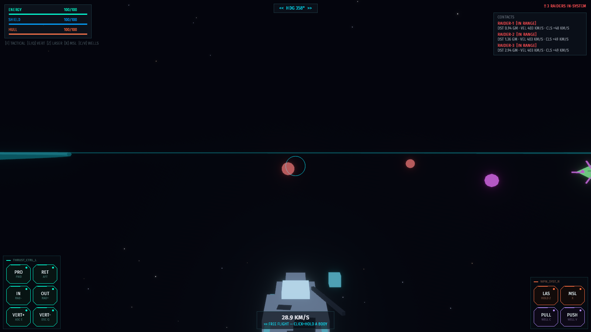
</p>

Real orbital mechanics in a hostile system. Propulsion is deliberately weak
against interplanetary distances — getting anywhere means **hitching rides on
gravity**: click a planet's orbit ring and the ship burns into a capture,
then the planet carries you around the system for free. Dive past a body in
free flight and its gravity — real, integrated — slings you out faster.
Meanwhile alien raiders hunt you in packs of up to six that keep getting
tougher with your pilot level, forever — under a living, storming sun, past
comets dragging ice down the dark, inside a procedural soundscape built for
the size of the void.

## The game

| | |
|---|---|
| 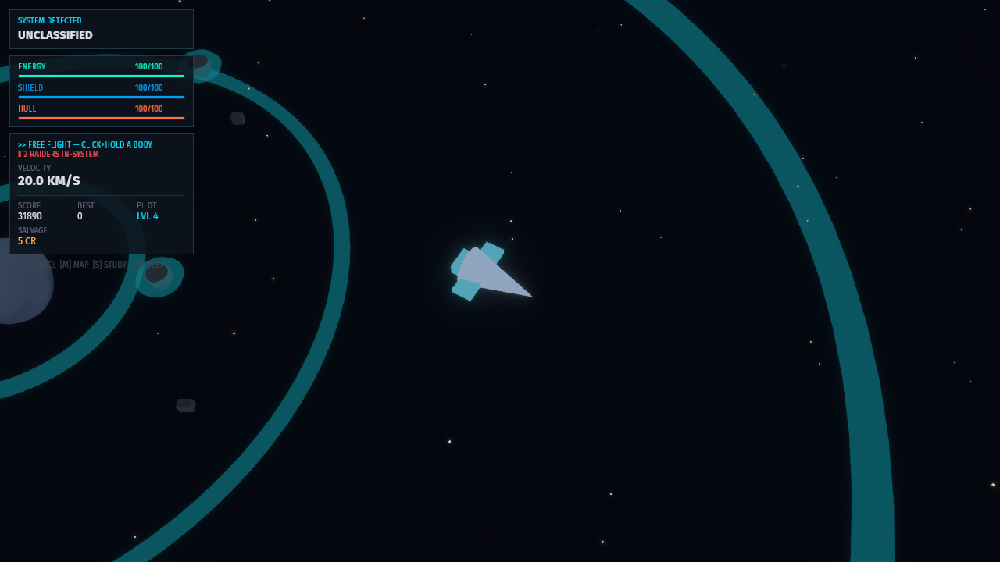 | **Ride the rings.** Every body advertises orbit rings — larger bodies throw larger rings, so a giant can be leapt onto from far away. One click on a ring and the ship plans the burn, captures, and rides; the orbit is sticky until you command another or hit EXIT. Riding recharges the tank, and the arrows throttle you around the ring in either direction. Energy prices every free-flight maneuver. |
| 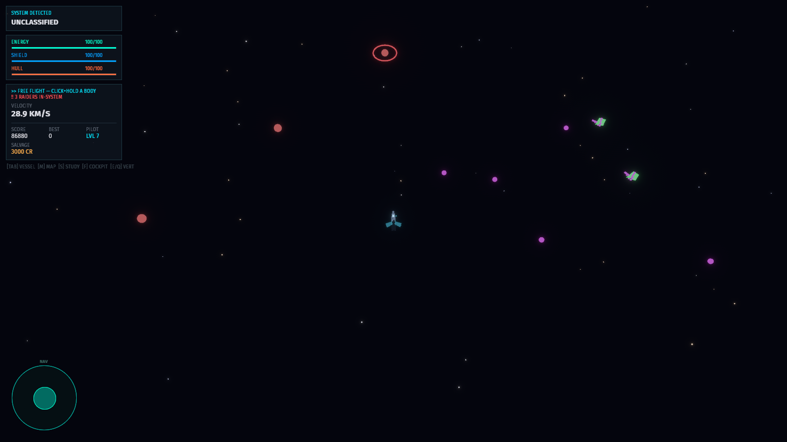 | **Click to lock, then fire.** Click any hostile vessel to designate it: a pulsing ring rides the target, the contacts stack flags it [LOCKED], and your laser and missiles prioritize it while it's in reach. Click again to release. |
| 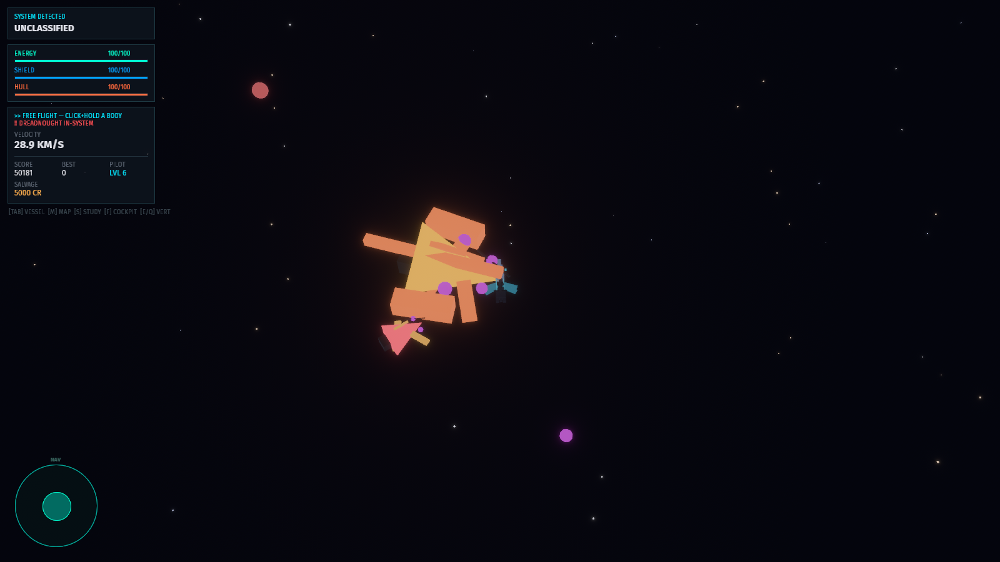 | **Fight what your level summons.** The sky runs on a bullet-hell curve: spawn waves tighten from 20 seconds toward a 6-second floor, packs grow from a lone raider to a **twelve-ship swarm** arriving in gangs of three from different bearings, and the ships themselves get bigger with depth — crimson elites from level four, mine-laying weavers from three, and past level twelve a **DREADNOUGHT** can turn up as a *regular* spawn, on top of the boss owed on a cadence that tightens from every five levels to every two. Score is bounty-weighted kills, so leveling means beating what the game sends. |
| 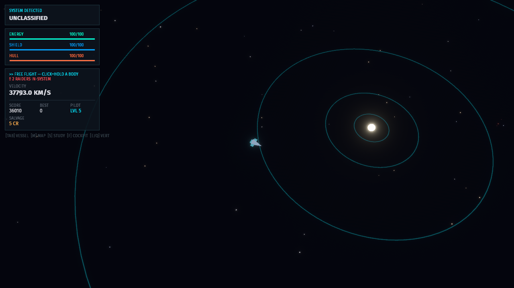 | **A whole galaxy on rails.** Deterministic f64 simulation at a fixed 60 Hz — celestials ride Kepler rails, the ship integrates. Zoom from cockpit to system scale and jump between the systems of your galaxy indefinitely — each one under its own **seeded nebula sky**, domain-warped clouds painted per system by a GPU shader at zero CPU cost. |
| 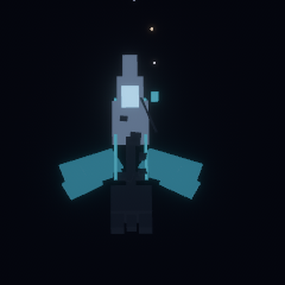 | **Your ship, your build.** Three frames (DART / LANCE / HAMMER), paints, accents — greebled hulls seeded per style, so every combination looks distinct (raiders are hand-built jagged prisms). Craft shield plating, drives, collectors, weapon racks — plus **hull plating** that raises your hull ceiling 25 per tier and a **light drive** that compounds 12% off every system-jump cost; tiers never cap. |

## The systems

| | |
|---|---|
| 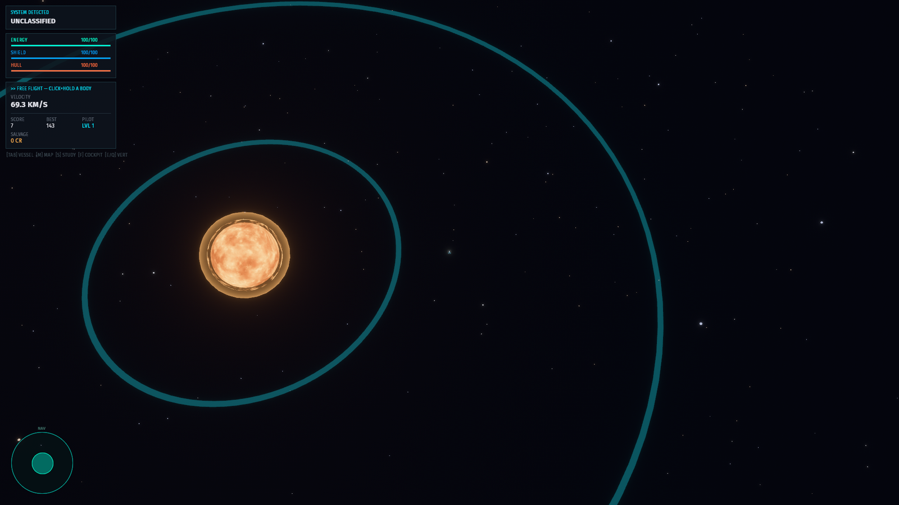 | **The living sun.** Every star is a WGSL shader, not a sprite: fractal plasma churns across the photosphere, seeded storm cells wander the surface and twist it into spiral arms with hot bright eyes, a flame shell licks the silhouette, and a corona breathes over it all. The palette rides each sun's spectral class — M-dwarfs smolder red, G suns burn gold, O giants blaze blue-white — and every system's seed churns differently. All of it animates on the GPU at zero per-frame CPU cost. And the sun **casts real light**: every hull, planet and piece of wreckage shows a lit day side facing it. |
| 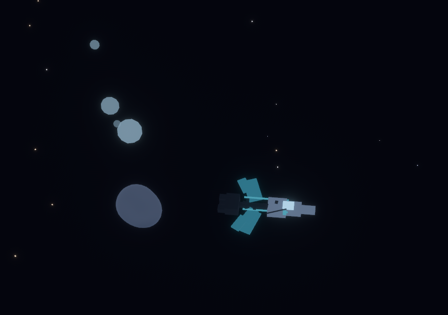 | **Comets.** Each system seeds sun-grazers on fierce ellipses. Near perihelion they outgas hard — a glowing mote tail that points away from the sun, as real tails do — and they drop chunks of collectible ice along their path. Fly through one and it hurts: the shield absorbs first (the reactor pays for the field), the rest burns to the hull, and the impact shoves you off your line. |
| 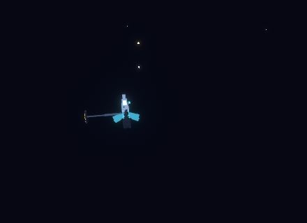 | **The solar arm.** Free flight has no ambient refueling — energy comes from riding an orbit, or from the deliberate, vulnerable act of deploying the arm (`P`): a telescoping boom aims at the nearest sun, the octagonal collector lights on its sun side, and the tank fills fast — but **weapons stay offline until it stows**. At full charge it stows itself. Better suns pour faster; they also burn hotter. |
| 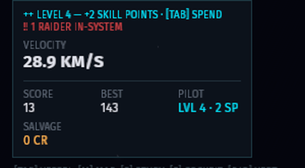 | **Level up, craft gear.** Rank is earned fresh every run — score is bounty-weighted combat, level comes from THIS run alone, and every restart begins back at level 1. Each new level banks **2 skill points** (unspent points die with the hull). Crafting the next tier of any gear slot costs that slot's **material recipe plus one point**: shields want titanium and ice, drives iron and carbon, graviton tech the uranium and aetherite that only radioactive worlds and raider wrecks supply. The vessel panel shows every recipe, your stash counts per element, and lights up what you can afford. Wreckage **streams to the nearest ship on its own** and pays twice: an element for the forge plus **salvage credits** — the CR readout is a spendable balance, and hull patches cost exactly that (2 CR per hull point, no materials, no points). Debris is PBR-real while it drifts: bare-metal iron and titanium, glassy ice, faintly glowing exotics, every piece tumbling so its **sun-facing side glints**. |

**The shield, visible — and weaponized.** Every ship wears its force field
as a glowing bubble whose aura tracks the shield points behind it: full
shield is unmistakable, a drained one barely shimmers. Craft the Shield
slot and `N` turns defense into offense — the **NOVA** dumps your whole
shield into an expanding wave that drinks reactor energy as it grows.
Hostile screens soak the punch until they're consumed (the burn-through is
your Shield tier — the shield weapon skill). And every celestial object
carries a **level**: outrank a moon, a planet, even a sun (rating = 2× 
Shield tier + pilot level) and the wave shatters it — suns burst into more
harvestable energy than any planet of their level, planets into debris
that scales with theirs, and the salvage magnet drags the corpse home.

## The sound of the void

Every sound is procedurally synthesized (`tools/synth_audio.py`) and embedded
in the binary: a 64-second seamless **space drone** — deep breathing fifths,
detuned pads, starlight shimmer, distant bells, every oscillator quantized to
the loop length — under an **engine hum** that fades up only while you burn,
and one-shot effects for everything that happens: laser zap, missile whoosh,
explosions with a sub-thump, shield shimmer, hull thud, orbit-capture chime,
salvage pickup, solar-arm servo, hull-critical warning. Browsers hold audio
until your first click; after that, the void hums.

## Made for phones too

<p align="center">
  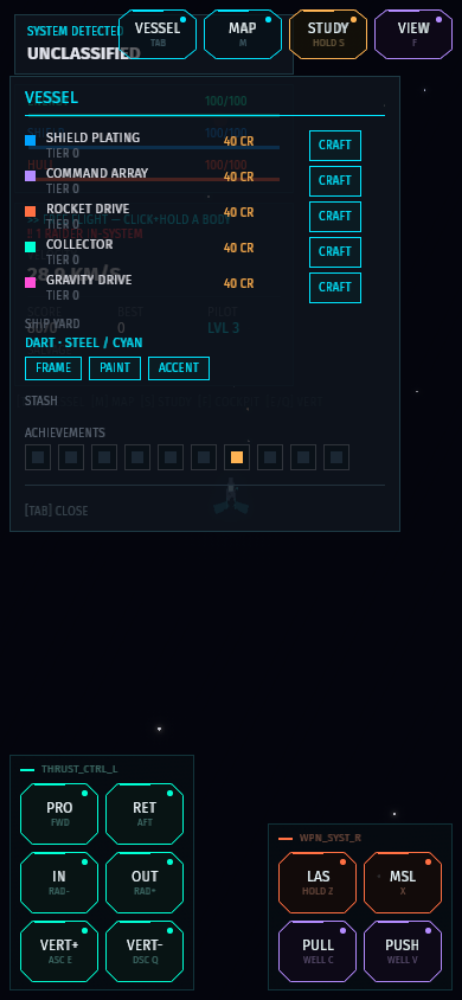
  &nbsp;&nbsp;
  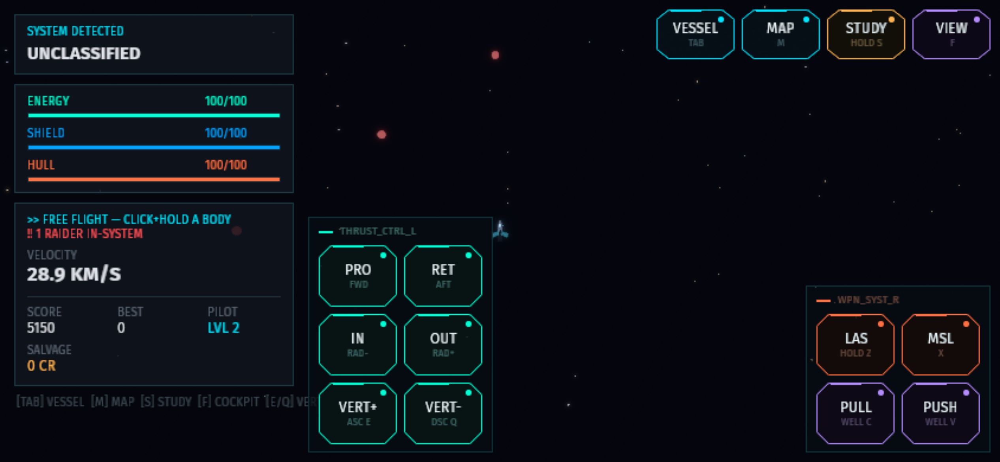
</p>

The same build runs in a phone browser with touch controls: an on-screen
**NAV stick** you drag with a thumb (analog thrust — up is prograde, sideways
is radial), chamfered console buttons with press feedback, and tap-to-lock
targeting. Portrait and landscape are distinct layouts, relaid live on
rotation.

**Install it like an app.** The web build is a PWA: on Android/desktop
Chrome an **INSTALL** chip appears (or use the browser menu's *Add to Home
Screen*); on iOS tap **Share → Add to Home Screen**. You get a home-screen
icon and fullscreen standalone play, with the last-loaded build cached for
shaky connections.

**And your run survives.** The game autosaves every few seconds — system,
position, velocity, vitals, score, rank — and the next launch resumes
exactly there, on desktop (a save file) and in the browser (localStorage,
so the installed app keeps your progress too). Gear, stash and career
records persist the same way. Death is the one exit that doesn't come
back: rank is per-run, and the save dies with the hull.

<details>
<summary><strong>Controls reference</strong></summary>

| Action | Desktop | Touch |
|---|---|---|
| Thrust | drag the NAV stick or arrows | drag the NAV stick |
| Command an orbit | click a body or ring | tap it |
| Exit the current orbit | `O` | **EXIT ORBIT** |
| Target lock | click an enemy vessel | tap it |
| Solar arm (refuel) | `P` | **ARM** |
| Climb / dive (3D) | `E` / `Q` | **VERT+ / VERT−** |
| Cockpit ⇄ tactical | `F` | **VIEW** |
| Laser / missile¹ | `Z` / `X` | **LAS / MSL** |
| Gravity wells¹ | `C` / `V` | **PULL / PUSH** |
| Shield nova¹ (Shield slot) | `N` | **NOVA** |
| Craft gear tiers | `1`–`8` | vessel panel CRAFT buttons |
| Patch the hull (salvage CR) | `9` | vessel panel REPAIR button |
| Vessel / map / study | `Tab` / `M` / `S` | topbar buttons |
| Zoom | mouse wheel, hold `-` / `=`, or drag the blue slider | drag the blue slider |
| Pan / tilt around the ship | drag the yellow pad (or hold `[` / `]` to tilt) | drag the yellow pad |

¹ once the weapon system is crafted — uninstalled weapons show no controls.

</details>

## Under the hood

- **[Bevy 0.19](https://bevy.org)** — ECS, 3D rendering, HDR + bloom
- **[bevy_pf](https://github.com/edgarhsanchez/bevy_pf)** — the HUD is XAML with data-bound view-models, including the animated console buttons (control templates, triggers, storyboards); the NAV stick is raw bevy_ui pointer capture
- **f64 simulation** — camera-relative f32 rendering keeps precision at Gm scales; sim state is `SimPos`/`SimVel` in meters
- **WGSL sun shader** — one material, three modes (plasma core / flame shell / corona), storm-warped fbm noise animated off shader time
- **Procedural audio** — every sound synthesized offline by a committed Python script and embedded as vorbis; no audio assets shipped
- **wasm** — the web build targets WebGL2 so it runs on iOS Safari and Android Chrome; a GitHub Actions workflow rebuilds and republishes on every push to main that touches the game
- Procedural planetoids (displaced icospheres with vertex-color banding), greebled ships — no art assets

The design reference lives in [docs/design.md](docs/design.md).

## Run it locally

```sh
cargo run --release -p oj_game
```

Or build the web bundle yourself (needs `wasm32-unknown-unknown`,
`wasm-bindgen-cli` 0.2.126, and optionally `wasm-opt`):

```sh
./web/build-wasm.sh   # outputs web/dist/
```

<p align="center">
  <a href="https://edgarhsanchez.github.io/orbit_jumper/"><strong>▶&nbsp;&nbsp;PLAY NOW</strong></a>
</p>
